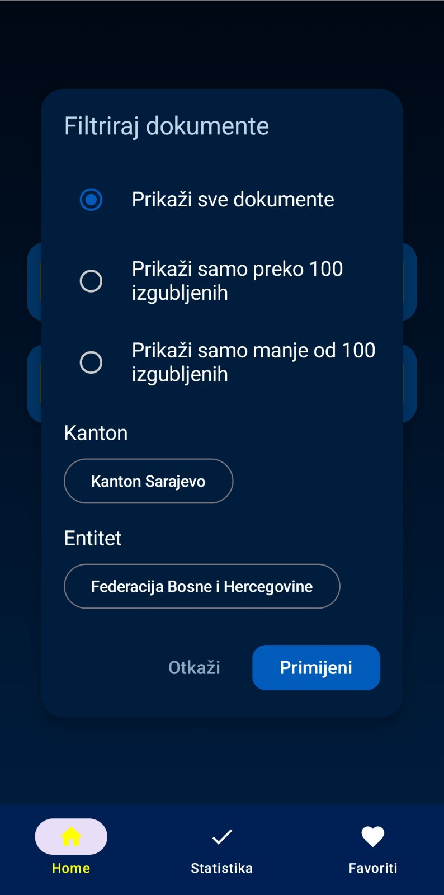
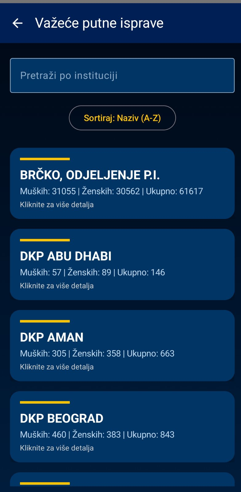
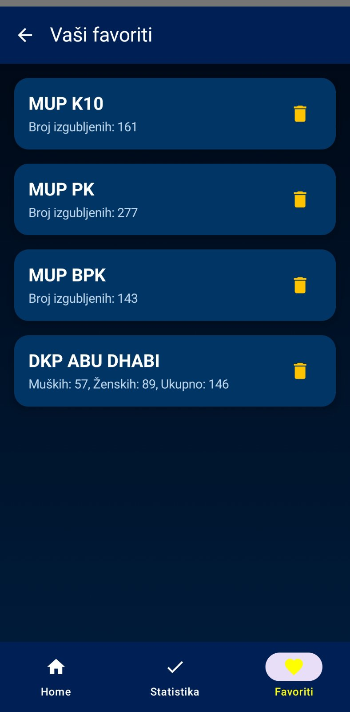
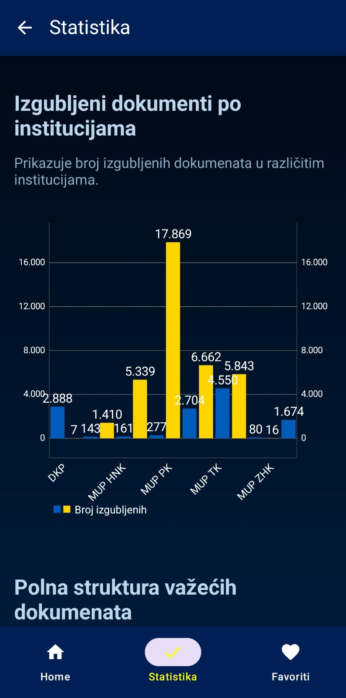
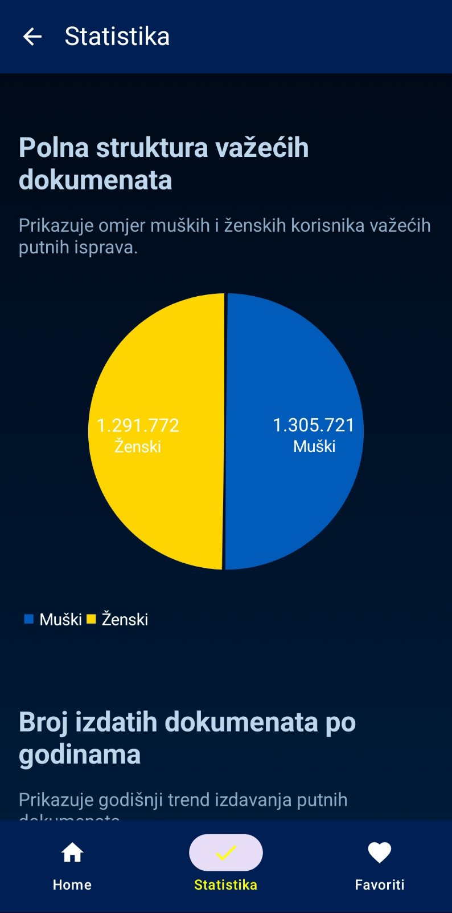
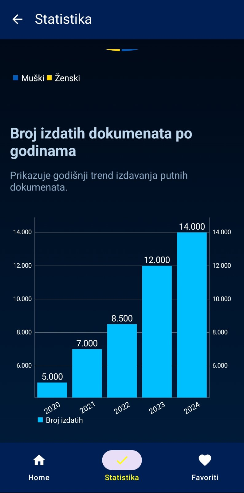
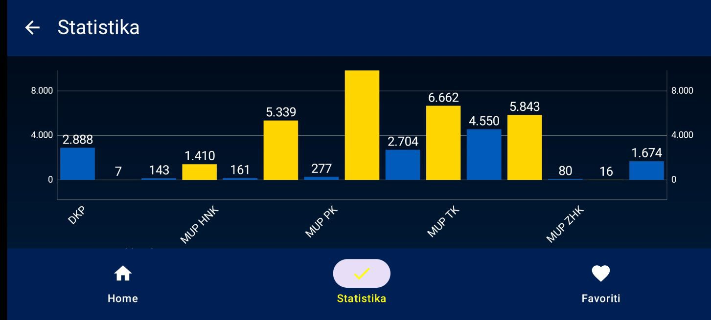

#  OpenDataBiH - Dokumentacija

##  Opis rada aplikacije
OpenDataBiH je Android mobilna aplikacija koja omogućava pregled i pretragu javnih podataka sa Portala otvorenih podataka Bosne i Hercegovine.  
Aplikacija koristi Web API za dohvat podataka i omogućava korisnicima:
- Pregled izgubljenih putnih dokumenata
- Pregled važećih putnih isprava
- Prikaz detalja za svaki dokument
- Pretragu i filtriranje podataka
- Sortiranje po različitim kriterijima
- Spremanje podataka u favorite
- Grafički prikaz podataka
- Dijeljenje podataka putem drugih aplikacija
- Offline keširanje podataka u Room bazi

Korisnički interfejs je jednostavan i dizajniran prema Material 3 smjernicama uz korištenje Jetpack Compose tehnologije.

---

## Slike ekrana (Screenshots)

### Splash Screen


**Opis:** Početni ekran aplikacije s animiranim logom koji se prikazuje pri pokretanju.

---

### Home Screen


**Opis:** Ekran za odabir dataset-a. Korisnik bira između izgubljenih dokumenata i važećih putnih isprava.

---

### Filtriranje


**Opis:**  
Modal za filtriranje koji omogućava korisniku da odabere entitet i opcionalno kanton.  
Ako korisnik odabere **Federaciju BiH**, tada se omogućava izbor kantona.  
Ako odabere **Republiku Srpsku** ili **Brčko Distrikt**, izbor kantona nije aktivan.

Dodatno, korisnik bira kriterij filtriranja putem radio dugmadi. Nakon potvrde, lista se filtrira prema odabranim opcijama.

---

### Izgubljeni dokumenti


**Opis:** Prikaz liste izgubljenih dokumenata s mogućnošću filtriranja i sortiranja po kantonu i entitetu.

---

### Važeće putne isprave


**Opis:** Prikaz važećih putnih isprava s pretragom po instituciji i sortiranjem po broju muških, ženskih i ukupno izdatih dokumenata.

---

### Favoriti


**Opis:** Ekran s pregledom dokumenata koje je korisnik označio kao favorite radi bržeg pristupa.

---

### Statistika






**Opis:** Grafički prikaz podataka: broj izgubljenih dokumenata po institucijama, polna struktura važećih dokumenata i broj izdatih dokumenata po godinama.

---

### Detalji dokumenta


**Opis:** Detaljan prikaz odabranog dokumenta s opcijom dodavanja u favorite i dijeljenja putem drugih aplikacija.

---

## Arhitektura aplikacije (MVVM)

Aplikacija koristi **Model-View-ViewModel (MVVM)** arhitekturu u kojoj su podaci, logika i korisnički interfejs jasno odvojeni u različite slojeve.


---

### Model sloj (Data sloj)

---

### Struktura API paketa i način rada

U projektu su podaci organizirani u dva glavna API paketa:
- `lostdocuments` – podaci o izgubljenim dokumentima
- `validtravel` – podaci o važećim putnim ispravama

####  Paket: lostdocuments
- **LostDocumentInfo** – Model koji predstavlja pojedinačni izgubljeni dokument. Sadrži informacije kao što su: naziv institucije, broj izgubljenih dokumenata, entitet, kanton i godina.
- **LostDocumentRequest** – Klasa koja definira parametre za slanje POST zahtjeva prema API-ju. Sadrži podatke kao što su: odabrani entitet, kanton, godina i opcije filtriranja.
- **LostDocumentResponse** – Model koji mapira odgovor API-ja. Sadrži listu izgubljenih dokumenata koji su stigli kao rezultat API poziva.
- **LostDocumentsApi** – Retrofit interfejs koji definira HTTP metode za komunikaciju s Web API-jem (POST zahtjevi za dohvat izgubljenih dokumenata).

#### Paket: validtravel
- **ValidTravelDocument** – Model koji predstavlja važeću putnu ispravu. Sadrži naziv institucije, broj muških, ženskih i ukupno izdatih dokumenata.
- **ValidTravelDocumentsApi** – Retrofit interfejs za komunikaciju s API-jem koji vraća važeće putne isprave.
- **ValidTravelDocumentsRequest** – Klasa koja definira tijelo POST zahtjeva za dohvat važećih putnih isprava.
- **ValidTravelDocumentsResponse** – Model koji mapira odgovor API-ja. Sadrži listu važećih putnih isprava.

#### RetrofitInstance
Klasa `RetrofitInstance` služi za kreiranje Retrofit klijenta koji omogućava pristup svim API servisima u aplikaciji. Ovdje se definiše osnovni URL (`Base URL`) i Retrofit konfiguracija.


---

- **data/local** – Room baza s DAO-ima i entitetima za rad s lokalno sačuvanim podacima.

Ovaj paket omogućava rad s lokalnom bazom podataka koristeći Room biblioteku.  
Room baza se koristi za:
- Čuvanje korisničkih favorita (offline keširanje).
- Omogućavanje pristupa favoritima bez potrebe za internet konekcijom.
- Upravljanje podacima kroz DAO (Data Access Object) koji omogućava jednostavne SQL operacije (insert, delete, query).

Room Entity definiše kako izgleda tabela u bazi, a DAO sadrži sve metode koje omogućavaju dodavanje, brisanje i čitanje favorita.

---

- **data/mapper** – Mapiranje podataka iz API-ja u lokalne modele za prikaz u UI-u.

API često vraća podatke u formatu koji nije direktno spreman za prikaz u korisničkom interfejsu.  
Zato se koristi mapper sloj koji:
- Pretvara API odgovore u jednostavne modele koje UI može direktno prikazati.
- Omogućava fleksibilnost da se backend promjene lako prilagode bez uticaja na UI.

Ovo mapiranje osigurava da su svi podaci uniformni i prilagođeni dizajnu aplikacije.

---

- **data/repository** – Repository odlučuje hoće li dohvatiti podatke s API-ja ili iz Room baze i sadrži logiku za filtriranje i keširanje podataka.

Repository je glavna kontrolna tačka za sve podatke u aplikaciji. On odlučuje:
- Kada će podaci biti dohvaćeni s interneta.
- Kada će biti korišteni lokalno sačuvani podaci iz Room baze.

Glavne uloge repository sloja su:
- Pozivanje Retrofit API servisa.
- Pozivanje DAO metoda za upravljanje lokalnim podacima.
- Obrada filtera, pretrage i sortiranja.
- Emitovanje rezultata prema ViewModel-u pomoću `Flow` objekata.

Ovaj sloj omogućava jednostavno skaliranje aplikacije jer se u budućnosti može proširiti da radi i s drugim izvorima podataka bez promjena u UI sloju.

---

### ViewModel sloj

- ViewModel komunicira s Repository-jem i šalje podatke UI-u.
- Koristi `StateFlow` i Coroutines za emitovanje i dohvaćanje podataka.
- Upravljanje pretragom, filtriranjem, sortiranjem i greškama.

---

### View sloj (UI)

- UI je razvijen u Jetpack Compose-u.
- Koristi `collectAsState()` za prikaz podataka u realnom vremenu.
- Sadrži ekrane za prikaz, filtriranje, pregled detalja i statistiku.

---
## UI komponente

UI sloj u aplikaciji je modularan i koristi zajedničke komponente koje se ponavljaju kroz različite ekrane. Komponente su smještene u `components` paketu i omogućavaju lakšu organizaciju i ponovno korištenje koda.

###  BottomBar.kt
Prikazuje donji navigacijski meni u aplikaciji.  
Omogućava brzo prebacivanje između Home ekrana, izgubljenih dokumenata, važećih isprava, statistike i favorita.  
BottomBar koristi Jetpack Compose `NavigationBar` komponente i automatski prikazuje aktivnu rutu.

### TopBar.kt
Prikazuje vrh ekrana sa nazivom trenutnog prikaza.  
Uključuje dugme za povratak kada je to potrebno.  
TopBar se automatski prilagođava trenutnoj ruti u aplikaciji.

###  LostDocumentsFloatingModal.kt
Modal komponenta za filtriranje izgubljenih dokumenata.  
Omogućava korisniku odabir entiteta, kantona i kriterija filtriranja.  
Prikazuje se kao dijalog iznad glavnog sadržaja i koristi Jetpack Compose `AlertDialog` i `RadioButton` elemente.

###  ValidDocumentsFloatingModal.kt
Modal komponenta za sortiranje važećih putnih isprava.  
Omogućava korisniku odabir entiteta, kantona i kriterija filtriranja.  
Prikazuje se iznad sadržaja i omogućava brzo filtriranje bez napuštanja ekrana.

---

Ove komponente:
- Povećavaju preglednost koda.
- Omogućavaju višekratnu upotrebu u različitim dijelovima aplikacije.
- Pružaju konzistentan izgled i ponašanje kroz sve ekrane.


## ViewModel Provider – Upravljanje instanciranjem ViewModel-a

`ViewModelProvider` klasa u projektu omogućava:
- Kreiranje ViewModel instanci koje zahtijevaju dodatne parametre.
- Prosljeđivanje potrebnih zavisnosti (npr. Repository) prilikom kreiranja ViewModel-a.

Omogućava pravilnu inicijalizaciju svih ViewModel-a u aplikaciji.

---

## ViewModel i ViewModel Factory

- ViewModel sloj upravlja poslovnom logikom aplikacije.
- Koristi `StateFlow` za emitovanje podataka ka UI sloju.
- Pretraga, filtriranje, sortiranje i upravljanje greškama.

**ViewModel Factory** omogućava:
- Pravilno kreiranje ViewModel-a s parametrima.
- Centralizovano upravljanje instanciranjem ViewModel-a.

---

## Ključne funkcije u LostDocumentsViewModel i ValidTravelDocumentsViewModel

- `fetchLostDocuments()` / `fetchValidDocuments()`: Dohvata podatke s API-ja.
- `fetchDocuments()`: Ponovno učitavanje podataka.
- `updateSortOption(option: String)`: Postavlja novu opciju sortiranja.
- `updateSelectedViewType(viewType: String)`: Postavlja prikaz tipa podataka.
- `updateSelectedCanton(canton: String)`: Postavlja odabrani kanton.
- `updateSelectedEntity(entity: String)`: Postavlja odabrani entitet.
- `updateSearchQuery(query: String)`: Ažurira tekstualnu pretragu.
- `applyAllFilters()`: Primjenjuje sve aktivne filtere.
- `applyFilterAndSort()`: Glavna funkcija za filtriranje i sortiranje.

---

## FavoriteViewModel – Upravljanje favoritima

`FavoriteViewModel` upravlja:
- Listom favorita u realnom vremenu.
- Dodavanjem i brisanjem favorita.
- Brisanjem po nazivu institucije.

Koristi `StateFlow` za sinhronizaciju s korisničkim interfejsom.

### Funkcije:
- `favorites`: Lista trenutnih favorita.
- `addToFavorites(favorite: FavoriteEntity)`: Dodaje novi favorit.
- `deleteFavorite(favorite: FavoriteEntity)`: Briše odabrani favorit.
- `deleteFavoriteByInstitution(institution: String)`: Briše favorit po instituciji.

---

## Navigacija

- Zasnovana na `NavHost` i `NavController` komponentama.
- `MainScreen` prikazuje donji meni i navigaciju.
- `AppNavGraph` povezuje rute i ekrane.
- Navigacija pomoću `navController.navigate(ruta)` i povratak pomoću `navController.popBackStack()`.

---

## Upravljanje stanjem i životni ciklus

- `collectAsState()` prati promjene podataka u UI-u.
- `remember` čuva lokalne vrijednosti u Compose-u.

Omogućava stabilan rad aplikacije i pravilno prikazivanje podataka.

---

## Korištene Android i Jetpack tehnologije

U razvoju aplikacije korišten je skup modernih Android i Jetpack tehnologija koje omogućavaju efikasno upravljanje podacima, stabilno asinhrono dohvaćanje, reaktivan korisnički interfejs i savremeni dizajn.

---

- **ViewModel** – Komponenta koja omogućava odvajanje logike od korisničkog interfejsa.  
  ViewModel:
    - Komunicira s Repository slojem.
    - Omogućava emitovanje podataka ka UI-u pomoću `StateFlow`.
    - Sadrži logiku za pretragu, filtriranje, sortiranje i upravljanje greškama.

---

- **StateFlow** – Reaktivni tok podataka koji omogućava emitovanje i praćenje stanja u realnom vremenu.
    - ViewModel koristi StateFlow za emitovanje trenutnog stanja aplikacije (loading, uspješan dohvat, greška).
    - UI koristi `collectAsState()` kako bi automatski reagovao na svaku promjenu bez potrebe za ručnim osvježavanjem.
    - Pruža stabilan i deklarativan način za sinhronizaciju podataka između ViewModel-a i UI-a.

---

- **Coroutines** – Asinhroni mehanizam za izvršavanje pozadinskih zadataka bez blokiranja glavnog UI threada.
    - Koristi se za pozive prema API-ju i pristup lokalnoj bazi.
    - Omogućava pokretanje više zadataka istovremeno, uz sigurnu kontrolu toka aplikacije.
    - Najčešće se koristi u ViewModel-u unutar `viewModelScope.launch {}` blokova.

---

- **Room** – Jetpack biblioteka koja pruža lokalnu bazu podataka za Android aplikacije.
    - U ovoj aplikaciji Room se koristi za čuvanje korisničkih favorita.
    - Omogućava offline pristup podacima.
    - Koristi DAO (Data Access Object) za jednostavne operacije nad bazom, poput dodavanja, brisanja i dohvaćanja favorita.

---

- **Retrofit** – HTTP klijent koji omogućava jednostavnu i efikasnu komunikaciju s Web API-jem.
    - Koristi se za slanje POST zahtjeva prema Portalu otvorenih podataka BiH.
    - Automatski mapira JSON odgovore u Kotlin modele.
    - Integrisan s Gson konverterom za serijalizaciju i deserializaciju podataka.

---

- **Jetpack Compose** – Moderni deklarativni alat za izgradnju korisničkog interfejsa u Android aplikacijama.
    - Omogućava brzu i jednostavnu izradu responsivnog UI-a kroz funkcionalni pristup.
    - Koristi `@Composable` funkcije za kreiranje ekrana, listi i grafičkih prikaza.
    - Automatski reaguje na promjene podataka kroz `collectAsState()`, bez potrebe za ručnim osvježavanjem prikaza.

---

- **Navigation Compose** – Jetpack biblioteka koja omogućava deklarativno i tip-sigurno upravljanje navigacijom unutar Compose-a.
    - Omogućava jednostavno definisanje ruta, prijenos parametara i upravljanje stack-om ekrana.
    - Koristi `NavHost` i `NavController` za implementaciju navigacije između svih ekrana u aplikaciji.

---

- **Material 3 Theming** – Savremeni vizualni dizajn u skladu sa Google smjernicama za Android aplikacije.
    - Omogućava dosljedno korištenje boja, tipografije, paddinga i stilova kroz cijelu aplikaciju.
    - Pruža responzivan i vizualno ugodan korisnički doživljaj koji je usklađen sa savremenim dizajnerskim trendovima.
    - Korišteni su Material 3 komponente kao što su `Card`, `TopAppBar`, `BottomNavigation` i `Button`.

---

---

##  Korištene Jetpack Compose komponente

U aplikaciji **OpenDataBiH** korišten je skup modernih Jetpack Compose komponenti koje omogućavaju izgradnju fleksibilnog, responsivnog i deklarativnog korisničkog interfejsa.

---

### LazyColumn
`LazyColumn` je Compose komponenta koja omogućava vertikalno skrolanje liste.  
Koristi se za:
- Prikaz liste izgubljenih dokumenata.
- Prikaz liste važećih putnih isprava.
- Prikaz grafova na ekranu statistike.

**Prednosti:**
- Efikasno renderuje samo trenutno vidljive stavke.
- Automatski optimizuje performanse za velike liste.

---

### BoxWithConstraints
`BoxWithConstraints` omogućava prilagodbu sadržaja u zavisnosti od veličine ekrana.  
Koristi se na ekranu statistike za:
- Ograničavanje maksimalne širine grafova na velikim ekranima.
- Fleksibilno pozicioniranje sadržaja unutar Box-a.
---
  


**Prednosti:**
- Prilagodljiv dizajn za različite uređaje.
- Omogućava responsivne komponente bez ručne kalkulacije veličina.

---

### AnimatedVisibility
`AnimatedVisibility` omogućava animirano prikazivanje ili sakrivanje sadržaja.  
Koristi se za:
- Animaciju pojavljivanja grafova na ekranu statistike nakon kratkog kašnjenja.

**Prednosti:**
- Pruža glatku tranziciju između prikaza i skrivanja elemenata.
- Unapređuje korisničko iskustvo sa animiranim ulazom podataka.

---

### AndroidView
`AndroidView` omogućava integraciju klasičnih Android View komponenti unutar Jetpack Compose okruženja.  
Koristi se za:
- Prikaz MPAndroidChart grafikona koji nisu nativno podržani u Compose-u.

**Prednosti:**
- Omogućava korištenje postojećih Android biblioteka bez potrebe za migraciju.
- Lako integriše vanjske grafičke alate u Compose ekran.

---

###  Spacer
`Spacer` se koristi za dodavanje praznog prostora između UI elemenata.  
Korišten je u:
- Ekranima sa listama za pravilno raspoređivanje stavki.
- Grafičkim sekcijama za vizualno odvajanje grafikona.

##  Biblioteke i grafički prikaz u aplikaciji

U ekranu za statistiku koristi se biblioteka **MPAndroidChart** za prikaz animiranih i interaktivnih grafova.  
Pomoću ove biblioteke omogućeno je jednostavno prikazivanje podataka u obliku bar chartova i pie chartova uz punu kontrolu nad bojama, legendama, animacijama i prikazom oznaka.

---

### Korištena biblioteka: MPAndroidChart

**MPAndroidChart** je jedna od najpoznatijih Android biblioteka za prikaz grafikona.  
U aplikaciji se koristi za:
- Prikaz izgubljenih dokumenata po institucijama (BarChart)
- Prikaz polne strukture važećih dokumenata (PieChart)
- Prikaz izdatih dokumenata po godinama (BarChart)

---

###  Korištene grafičke komponente

####  BarChart
- Koristi se za prikaz broja izgubljenih dokumenata po institucijama i broja izdatih dokumenata po godinama.
- Podaci se šalju putem objekta `BarDataSet` koji definiše grafikon.
- X osa koristi `IndexAxisValueFormatter` kako bi prikazivala nazive institucija i godine.
- Animacija prikaza se pokreće pomoću `animateY(1000)`.

####  PieChart
- Koristi se za prikaz polne strukture važećih dokumenata.
- Podaci se šalju pomoću `PieDataSet` i `PieEntry` objekata.
- Isključena je centralna rupa grafika pomoću `setDrawHoleEnabled(false)`.
- Legenda i vrijednosti se prikazuju sa podešenim veličinama i bojama.

---

## Korištenje SwipeRefresh komponente (Pull-to-refresh)

Aplikacija koristi `SwipeRefresh` komponentu iz Accompanist biblioteke za ručno osvježavanje podataka povlačenjem liste prema dolje.

### Primjer koda:
```kotlin
val isRefreshing by viewModel.isRefreshing.collectAsState()

SwipeRefresh(
    state = rememberSwipeRefreshState(isRefreshing),
    onRefresh = { viewModel.fetchDocuments() }
) {
    // Ovdje se prikazuje LazyColumn sa podacima
}
